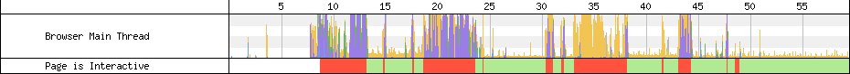
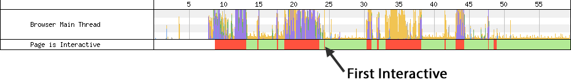
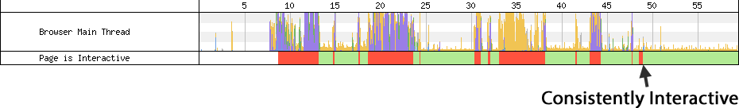

# Time To Interactive - Measuring more of the user experience.

Sometimes it feels like we keep inventing new metrics just to mess with people and move the goalposts but for the most part new performance metrics come along as our understanding of the user experience and the landscape of the web evolves.

Historically we (web developers and browsers) were largely focused on technical metrics that didn’t necessarily relate to the user experience (Page Load Time and DOM Content Loaded for example).  Over the last few years there has been a strong push to focus more on metrics that represent the user’s view of the web browsing experience.  This brought us things like “Speed Index”, “first paint” and site-specific measurements like “time to first tweet”.

As the web started moving to client-rendered single-page-apps the render-based metrics penalized them very heavily (correctly-so) because the user would be staring at a blank screen until all of the application logic could be downloaded and run to generate the UI.  Virtually all of the application frameworks moved to supporting server-side-rendering of the initial view, sending down the HTML so it could be displayed quickly and then attaching the application logic after the fact.  This way they got the best of both worlds.  A fast visual experience while still supporting a rich app-like experience.

...or did they?

As more and more apps moved to server-side-rendering and as the applications got richer and richer we started to notice a disturbing pattern.  The applications would be visually displayed quickly but if the user actually tried to interact with the page they would be met with a UI that wasn’t reacting to their input.  They could be mashing on a button or link in the UI and nothing would happen for several seconds (sometimes 10’s of seconds).  This is because the UI was delivered quickly but the code to hook up the application logic would take several seconds to execute and would block the browser’s main thread for the whole time.

To help provide some visibility into the main thread readiness, WebPageTest added a bar along the bottom of the waterfall to indicate when the browser’s main thread is responsive or not (not being responsive is any period where the main thread is blocked for more than 50ms):

At a conceptual level, Time To Interactive is a measurement of when the main content has been delivered and the user can reasonably expect it to be responsive to input.

Translating the concept into a technical measurement that can be applied without application-specific knowledge has proven to be difficult and the definition of how to do that is evolving but the current implementations expose two different measurements:

1 - Time To First Interactive - This is the earliest point after the main content has rendered where there is at least a 5-second window where the page is responsive.

2 - Time To Consistently Interactive - This is the point where the page can be expected to always be responsive to input.

In practice, the biggest difference between the two metrics is that Consistently Interactive will catch any large delays that are introduced late in the page load (like a really slow onload event handler) while First Interactive won’t penalize for them though that does lead to some cases that aren't necessarily representative of the user experience:

Neither metric is perfect and they are still evolving and should just be considered as additional metrics in your arsenal when working on performance.
