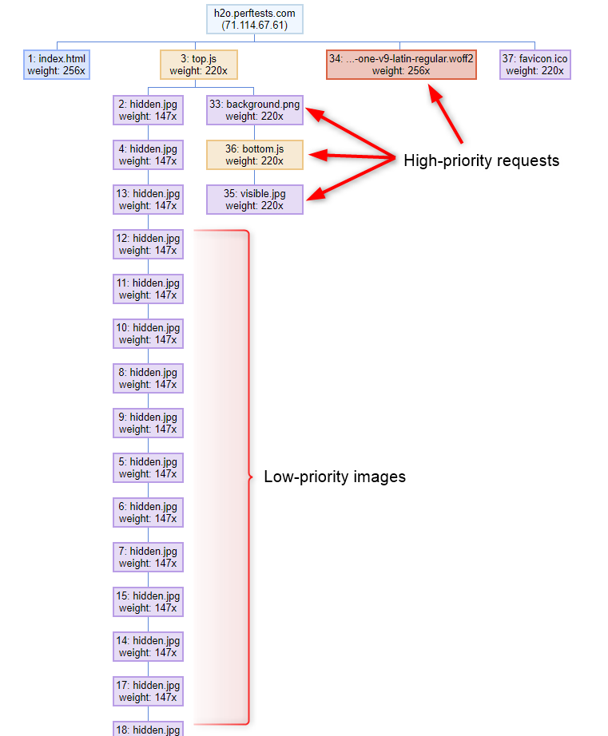
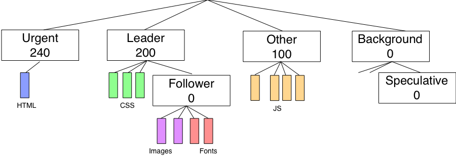
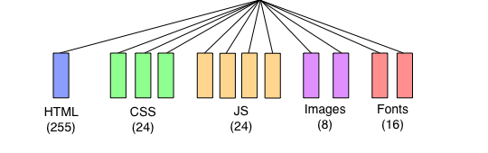
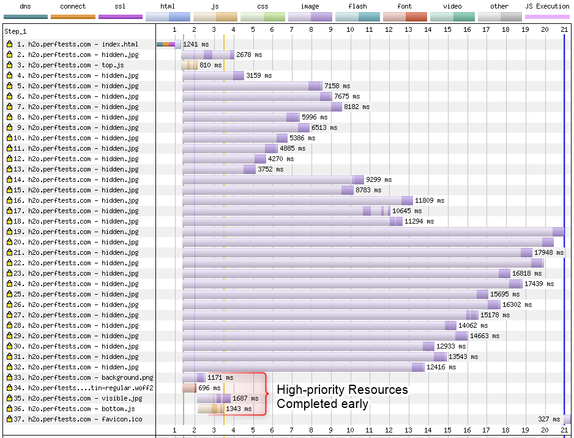
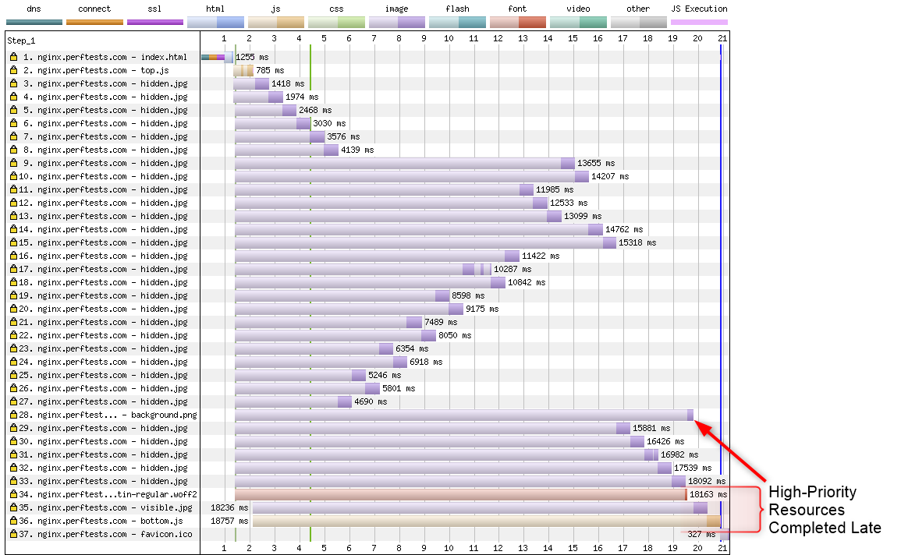
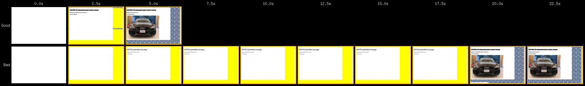

# HTTP/2 Prioritization

Requesting page resources in the correct order is critical for a fast user experience. Imagine, for example, a web page with a bunch of large images on it as well as an external stylesheet, a custom web font and a few scripts in the head. If the browser downloaded all of the images first and loaded the stylesheet last then the page would be completely blank until absolutely everything had loaded. If the browser loaded all of the blocking resources first followed by the web font and visible images then it could render the page much earlier and let the user start to consume the content while the rest of the images load. I'd venture that the vast majority of my time working on Chrome performance was spent on trying to optimize the order in which resources were loaded for the best user experience.

With HTTP/1.x the browser is in complete control of the resource loading order. Each connection can only support one request for a resource at a time and the server returns whatever was requested as quickly as it can. Browsers could schedule requests by deciding when to ask for a resource and how many connections it opened in parallel.

HTTP/2 made things both a lot better and a lot more complicated. Instead of one request at a time, the browser can request multiple resources, specify some priority information to help determine how they should be delivered and sit back while the server takes care of sending all of the data back. If the browser and server both support prioritization then the resources should be delivered using the rules the browser specified and using the full available bandwidth without having resources compete with each other.

Every resource gets a stream ID to identify the resource on the connection and there are three parameters for defining the resource prioritization:

1. **[Parent Stream](https://http2.github.io/http2-spec/#pri-depend)**: A stream that this resource "depends on" or should be delivered after. There is a virtual root stream 0 that is shared by all streams.
1. **[Weight](https://http2.github.io/http2-spec/#rfc.section.5.3.2)**: A number from 1 to 256 identifying how much of the bandwidth to allocate to this stream if multiple streams are sharing the connection. The bandwidth is allocated relative to the the weights of all other active streams and is not an absolute number.
1. **[Exclusive bit](https://http2.github.io/http2-spec/#HEADERS)**: A flag indicating that the stream should be downloaded without sharing bandwidth with any other streams.

The browser doesn't necessarily know about all of the resources at the same time so it is also critical for the server to be able to reprioritize requests as new ones arrive.

So...How are we doing?

## Browser Engines

### Chrome
This includes everything using Chromium's prioritization logic and networking stack.

Chrome is the only browser to use the **exclusive bit** and it uses it on EVERY resource. It builds a long chain of resources, linking lower priority resources to the last equal or higher priority resource that is still pending. If there are no higher priority resources pending it starts a new chain. The weights are assigned with a static mapping from Chrome's five internal levels of priority to a weight (i.e. HIGHEST becomes 256).

The assumption is that, given several queues of requests, all with the exclusive bit set, the server will pick the one with the highest weight, deliver it completely, pop it off the list and re-select.

Assuming Chrome builds the ordering correctly, this can be very effective. Downloading resources exclusively is optimal for blocking resources like stylesheets and scripts. When it comes to images and video though you probably want some amount of interleaving (particularly for progressive images). Otherwise you're waiting for each image or video to download completely before moving on to the next request. 

### Firefox
Firefox went all-in on HTTP/2's tree structure and built a tree of phantom streams that serve as groupings for different types of requests. The groupings are weighted so more bandwidth is given to more important groups and idle cycles can be used for responses when all of the peers have completed.

There is a "leader" group that gets twice as much bandwidth as a "Other group" at the root level. Within the "leader" group there is a child "follower" group that will only download when the direct descendants of the leader group have completed. For example, images and fonts download at "leader" weight of 200 once all of the CSS has completed downloading. All child resources within a group have the same weight and split the bandwidth evenly (downloading all of the images or all of the scripts concurrently).

The overall structure is brilliant and provides for defining idle cycles for speculative requests but downloading all resources concurrently isn't great for prioritization. Blocking resources like stylesheets and scripts are much better off downloading in the order they are needed for the parser to be able to work through the document.

### Safari
This includes ALL browsers on iOS (including Chrome).

Safari takes a very simplistic approach that looks to be leftover from SPDY's prioritization. The five internal webkit priorities are mapped statically to weights and there are no dependencies defined. All requests download concurrently with the bandwidth weighted based on the priority level for each resource (scripts getting three times the bandwidth of images for example).

The high level of concurrency here isn't great and is a step backwards from Firefox's implementation where at least the follower resources wait until after the leader resources all complete (though it may not be a big enough step back to justify the complexity of the Firefox tree).

### Microsoft Edge/Internet Explorer

Put simply, Microsoft Edge (and Internet Explorer) do not support prioritization at all. All requests split bandwidth evenly (pretty much the worst possible case).

## Servers/Hosting/CDNs

Most servers at this point support HTTP/2 and those that do also usually "support" prioritization. Support is in quotes though because even if a server supports prioritizing resources internally, having it actually work all the way to the browser requires tuning of the networking stack and reducing output buffering as much as possible without impacting thruput.

Buffering can be a problem because the server can send a bunch of low-priority responses that get queued in the buffers before a high-priority response arrives. When the high-priority response is sent there is no way to preempt the lower-priority responses that are already buffered. Buffering can come from the server itself, the TLS layer, the TCP send buffers or even from bufferbloat on the network and tracking down and eliminating all of the excess buffers can be complicated. I touch on a few of the causes and solutions in a [blog post from earlier this year](https://blog.cloudflare.com/http-2-prioritization-with-nginx/) but it is not an exhaustive list.

To test for the effectiveness of server prioritization I built a [test page](https://github.com/pmeenan/http2priorities) that you can deploy on your serving stack to see if prioritization is working correctly. It targets Chrome's prioritization logic specifically so it is best tested using Chrome on a slow connection. It queues up 3 MB of low-priority images that are below the fold and then after downloading and executing a high-priority script it causes 4 high-priority requests to be sent (a visible image, a page background, a custom webfont and a blocking script). When prioritization is working the late-requested resources jump ahead of the low-priority requests and are returned quickly:

When prioritization isn't working correctly some or all of the late-requested resources are delayed until the lower priority requests complete:

The delay of the late-requested blocking script pushes out the "DOM Content Loaded" metric and the delay of the font and 2 images has quite a dramatic impact on the visual experience:

## Where do we go from here?

To keep track of how well CDN's and hosting providers are supporting HTTP/2 prioritization, [Andy Davies](https://twitter.com/AndyDavies) created a [GitHub repository](https://github.com/andydavies/http2-prioritization-issues) that tracks the current state of the world and where anyone can submit test results to crowd-source the state. As of this writing the situation is pretty dire and only two CDN's actually prioritize correctly and there are some very-shocking failures (like every cloud provider and even Google's GFE's). Hopefully by bringing more awareness to the situation we will be able to drive broader support for prioritization.

The good news for hosting and server support is that you can always throw a CDN that supports prioritization in front of it to solve the problem (though it would be nice for it to be supported directly).

On the browser side of things there's not a lot that can be done other than pressing the browsers for better support. Some of them may have architectural issues with how their browser engine is layered on top of the operating system's networking stack where they can't pass prioritization information through. I'm probably biased but I think Chrome's gets the closest to being "right" but there is still a fair amount of room for improvement.

HTTP/3 is also coming but the actual prioritization scheme doesn't change. What does change is where the networking stack terminates. On the server side this means the operating system's buffering and congestion control no longer come into play and it is 100% the responsibility of the server software to minimize the buffering (including the congestion control algorithms to minimize bufferbloat).

On that note, here's hoping for the sake of HTTP/2 and a secure, performant web that we can get resource prioritization fixed in 2019.