# Analyzing Web Vitals with WebPageTest

The [Web Vitals](https://web.dev/vitals/) are a set of web page performance metrics that Google recommends using to better understand the user experience of a given page. They are the latest evolution of web performance metrics away from browser-centric metrics and towards understanding how a page feels to a user when it is loading and being interacted with.

[WebPageTest](https://www.webpagetest.org/) uses the lab versions of the Core Web Vitals and presents them at the top of the main results page:
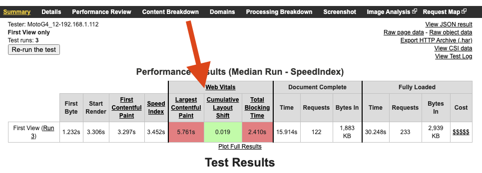

The results are color coded based on the performance targets set by Google for Good, Needs Improvement and Poor and the actual results will depend heavily on the test conditions used to run the test (connection speed, device type, etc).

The main difference between the real-user Core Web Vitals and those measured in the lab are around input delay. In real-user measurements, the [actual delay](https://web.dev/fid/) for a user's input is measured but in a lab, since there are no users interacting with a page, [Total Blocking Time](https://web.dev/tbt/) is used instead to gauge how much the page blocks the main browser thread (blocking user input).

Beyond the top-line metrics, WebPageTest provides several ways to visualize the metrics and to help you debug and improve them.

## Largest Contentful Paint (LCP)
[Largest Contentful Paint](https://web.dev/lcp/) is the latest iteration of visual metrics that attempts to measure when the main user content is displayed (main story on an article, product image on a product details page, etc). It works much more consistently and is easier to understand than previous visual metrics like [SpeedIndex](https://web.dev/speed-index/) and can be measured both in the lab and in the field.

Most of the visual metrics and debugging tools in WebPageTest are surfaced in the filmstrip view of the test results. It is one of the most useful pages in the WebPageTest results and can be reached by clickling the "Filmstrip View" link to the right of the page screenshot (when video capture is enabled for a test).

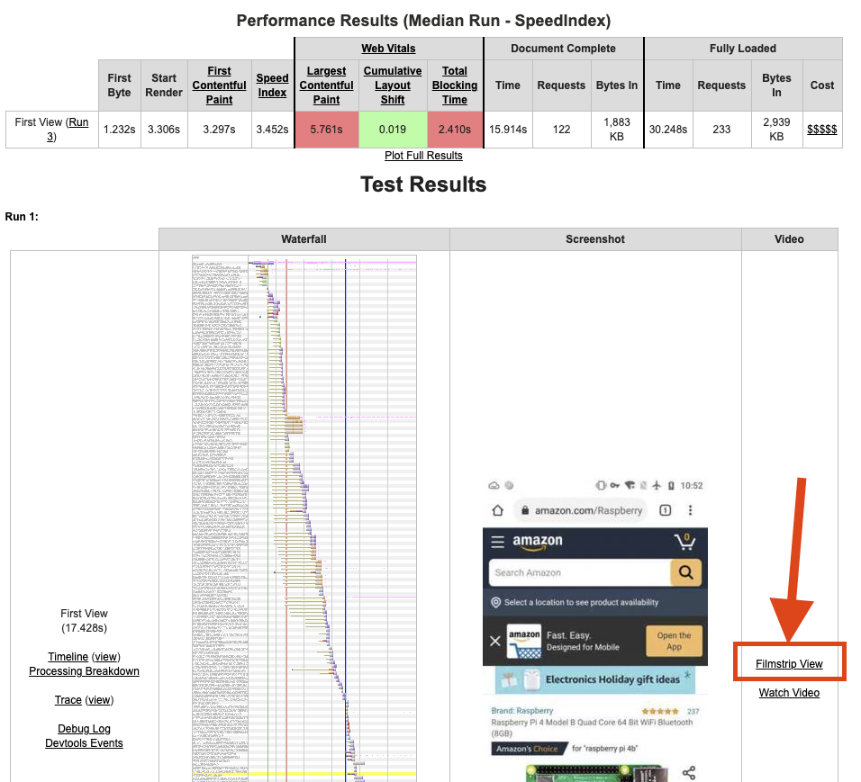

The page is probably not exposed as well as it should be for how useful it is but once you get used to it, it will likely be your main page for looking at a given test.

In the filmstrip view there is a filmstrip of the page loading at the top of the page with a waterfall of the requests and a bunch of metrics graphs below the filmstrip.

The colored frames around the images in the filmstrip show when content changed. A yellow border indicates that "something" changed since the previous frame and a red border indicates the frame that Chrome has reported as the Largest Contentful Paint.  This should provide a quick way to understand where in the loading cycle LCP was measured and to validate that it is measuring what you would expect it to.

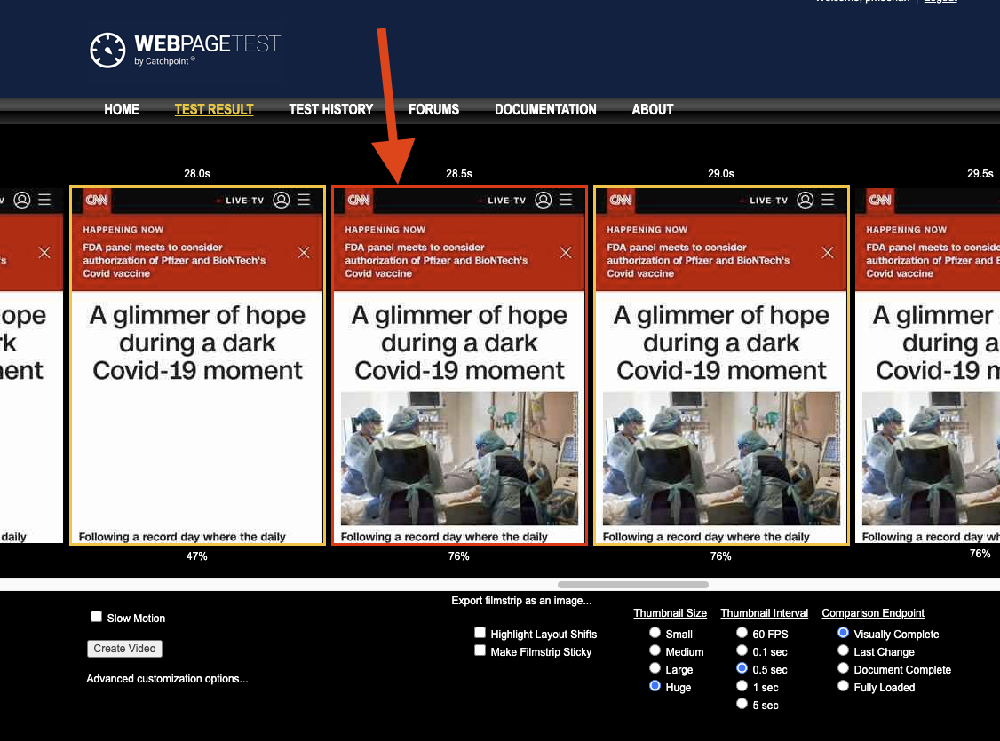

You can then use the waterfall below the filmstrip to understand what contributed to the time and build a plan for improving it.

LCP is the latest and best measurement we currently have for measuring when the main content appeared but it does still have some edge cases that the team is working to improve.

When an image is the content that triggers LCP, the measurement is not recorded until the image is fully loaded. When using progressive images in particular, it may look like it is recording LCP too late.

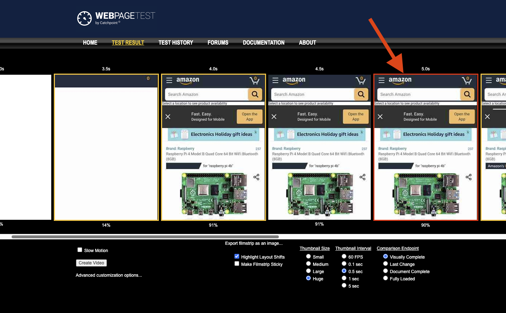

You might be tempted to switch to a non-progressive format that generates smaller images to improve the overall LCP but I'd recommend seeing what the user experience would be for the change and not doing it just for the sake of the metric since it will evolve and change over time to handle these edge cases better.

Another common cause of LCP showing up at unexpected times is background images for pages. The Chrome team has been improving the logic to better handle those cases and ignore page backgrounds but depending on how they are implemented they may still end up being the trigger for LCP. Again, you might be tempted to preload the background image to trigger LCP sooner but make sure the image is actually important to the user experience before delaying other things for it, particularly since the metric may evolve to ignore your background image.

In the other direction, Chrome can sometimes report LCP before anything is actually painted on the screen. This can happen when a page intentionally hides the content while it is being built and then reveals it at a later point in time. Some of the common cases for that (A/B testing) have been fixed but if you see other cases where it is still reporting incorrectly make sure to let the team know.

## Cumulative Layout Shift (CLS)
[Cumulative Layout Shift](https://web.dev/cls/) measures how much the visible content on the page moves unexpectedly. This can be really annoying when the user attempts to click on something and then that element moves, resulting on a click elsewhere on the page (like accidentally clicking an ad instead of the "add to cart" button).

In WebPageTest, frames where Chrome has reported a layout shift are indicated by a dotted border. Since it's not always clear what content shifted, there is also a "Highlight Layout Shifts" checkbox below the filmstrip that will highlight the area of the content shift reported by Chrome in red:

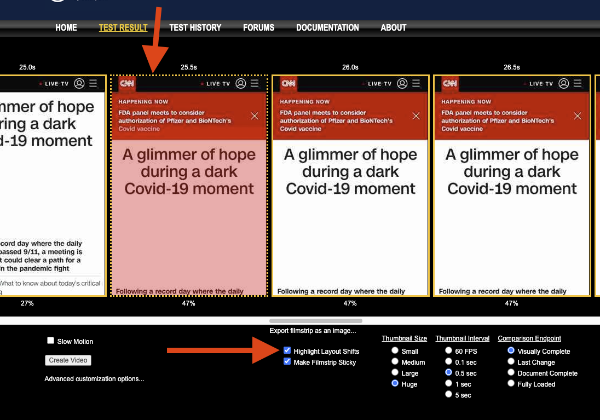

Below the filmstrip is also a checkbox to "Make Filmstrip Sticky" which will keep the filmstrip at the top of the page as you scroll through the content below.  If you scroll down to the metrics graph there is also a timeline graph showing the overall CLS and how much it increased with each shift so you can compare the metric to the visual experience.

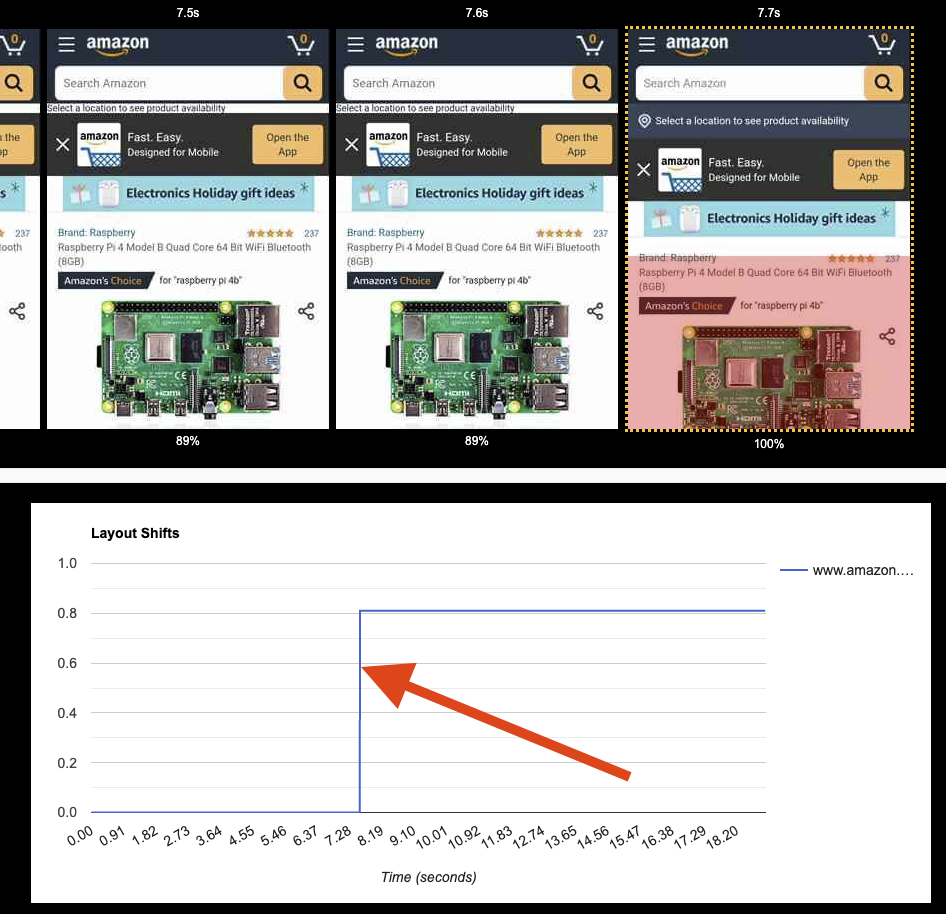

Like the rest of the web vitals, there are still a few rough edges and edge cases that the team is working through where the reported content shift doesn't appear to match the screen or the timestamp of the change. When that happens it can help to check the frame on either side of the reported shift to see if the time was just mis-reported or if a shift was reported with no visible change (which can happen some times for various reasons).

For example, in this case, the shift was reported slightly early but you can see in the next frame that the whole page moved down when content was inserted at the top:

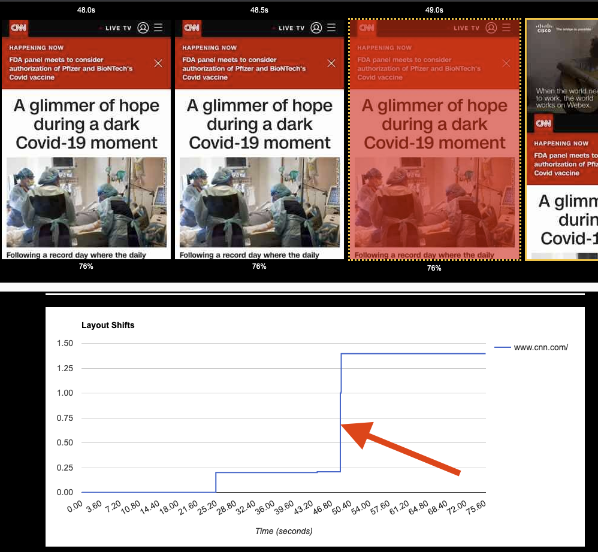

## Total Blocking Time (TBT)
[Total Blocking Time](https://web.dev/tbt/) and the real-user [First Input Delay](https://web.dev/fid/) metrics are attempt to quantify how responsive an application is to the user after it has loaded. This is a critical part of the user experience to measure because it doesn't help a whole lot if the content becomes visible quickly but the user can't actually tap or scroll the content.

In the lab, this is reported by taking all of the long tasks (things that block the main browser thread for more than 50ms) and summing them up into an aggregate time to represent how "blocked" the main thread was after content was visible on the screen.

Unlike the other metrics, TBT is not a point-in-time measurement and doesn't represent how quickly the page became usable, it's more of a proxy metric for how likely it is that the user will have a non-responsive experience interacting with the page.

In WebPageTest, the long tasks are displayed at the bottom of the waterfall as red bars with wider bars indicating larger periods of inactivity. Directly above the long tasks is the chart of the main thread activity so you can understand what was blocking the main thread (yellw is script execution, purple is layout).

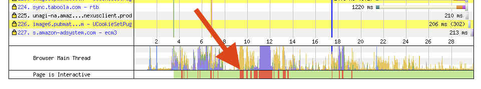

In the waterfall itself on the line for each request WebPageTest also indicates when each script is executing so you can scroll through the waterfall and quickly identify which scripts are responsible for the long tasks.

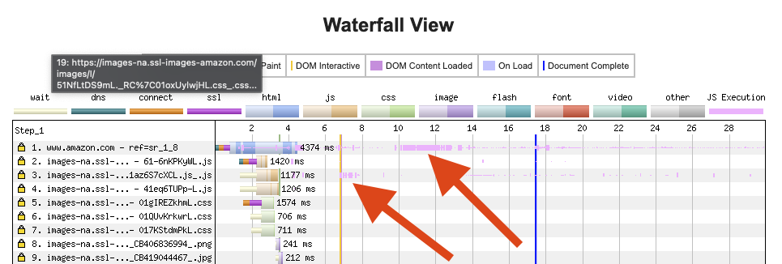

In the table view of the requests below the waterfall the total CPU time for each script is also reported (clicking the table header will sort by the given column).

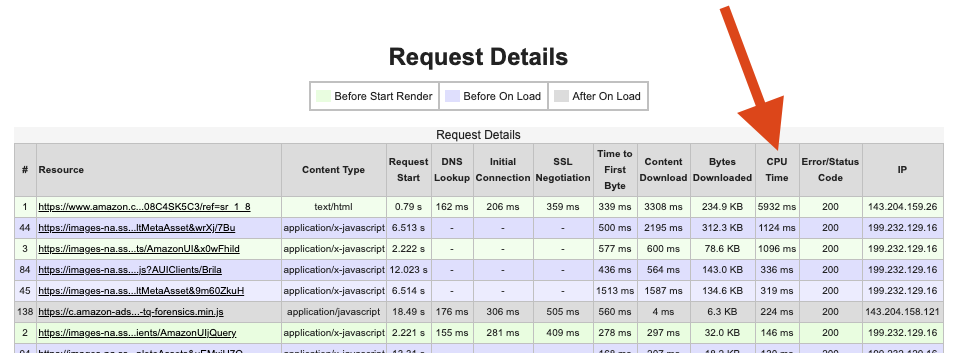

If you need to dig deeper into the details of WHY a given script is executing or exactly what functions are causing the long tasks, you can open a Chrome dev tools view of the test. On the main results page to the left of the waterfall are links for the timeline to download the timeline recording locally or to view it directly in an embedded dev tools viewer.

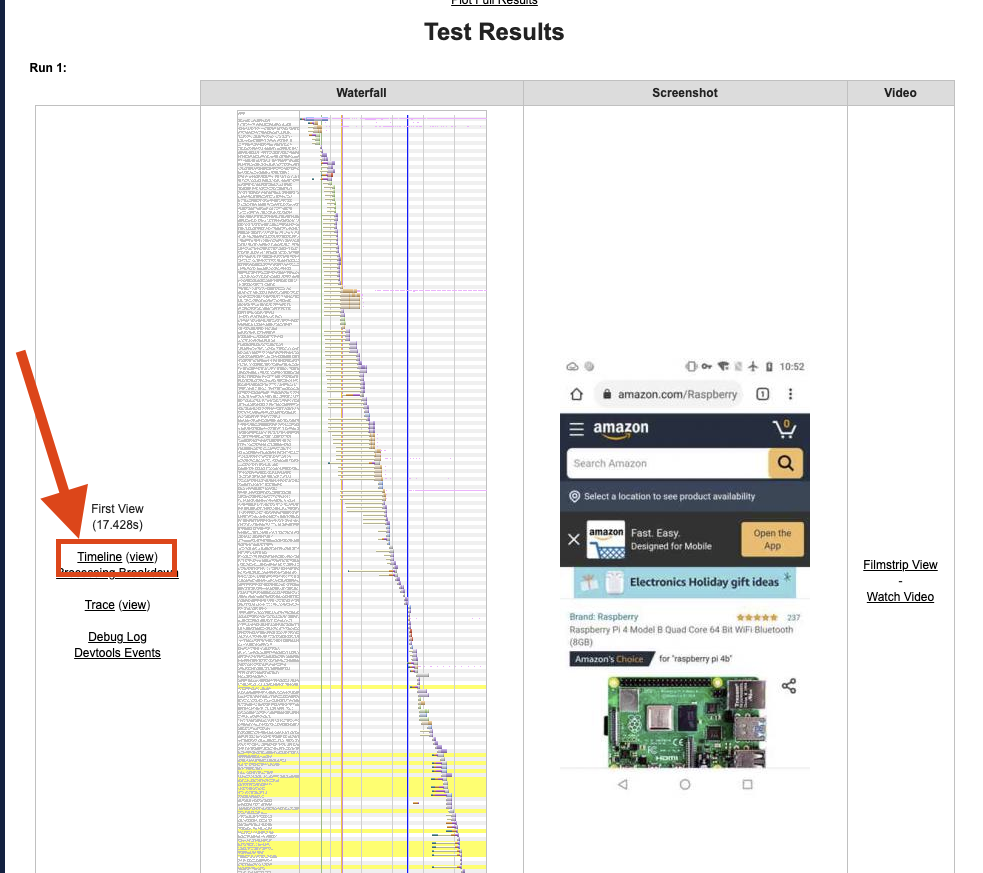

Within dev tools you can then track down the specific function that is causing each long task. For example, in this case it was a timer callback that triggered a forced layout that caused the main thread to block for 1.25 seconds.

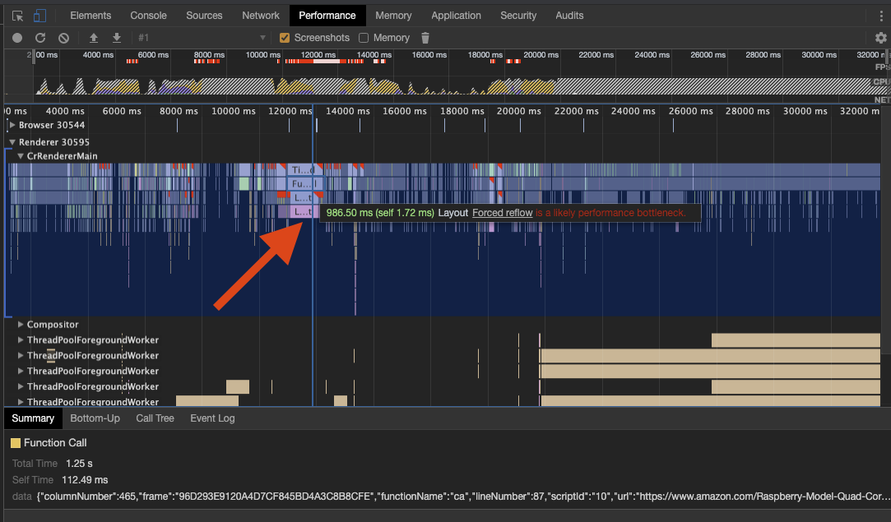

If you select the "CrRendererMain" thread that you are interested in you can also use the dev tools capabilities for grouping function calls by script and by call tree.

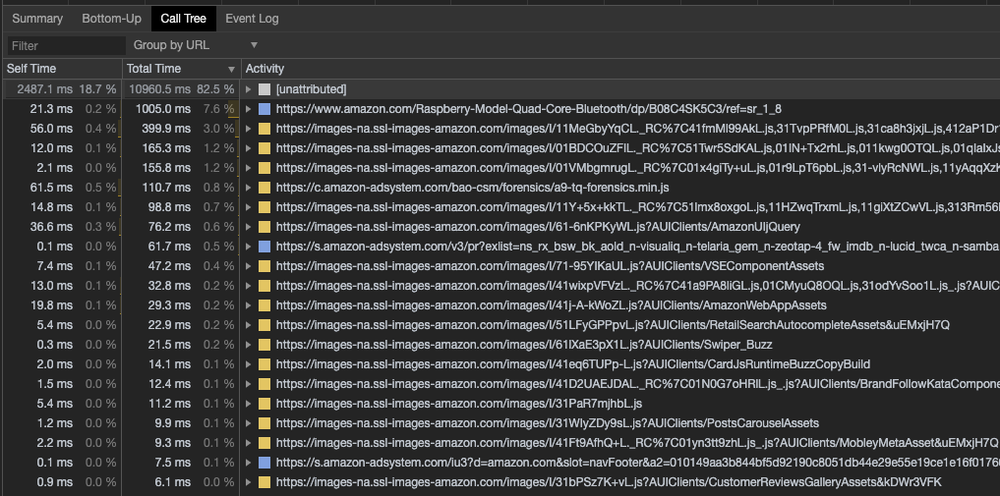

## Focus on the user experience

The Web Vitals are the latest, best metrics we currently have for representing the user experience but they are also evolving. It might be tempting to optimize for them specifically since they are going to become part of Google's search ranking and that makes total sense, as long as they accurately measure the user experience for your site.  As we've seen, there are still a fair number of edge cases where it may not quite get it right and if you optimize specifically for those cases you run the very real risk of the metrics improving their accuracy and negating the work you did.

It is much better to focus on the user experience and engage with the Chrome metrics team and [W3C web performance working group](https://www.w3.org/webperf/) to make sure the metrics represent your use case correctly.

I, for one, am really excited to have these new metrics and to see them quickly evolving to improve the quality of their measurements.